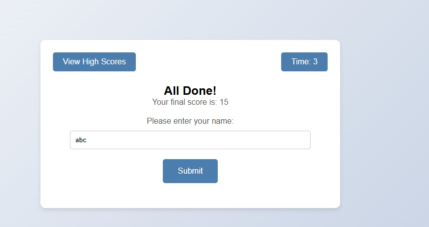

# 🎯 Quiz Website

> 🧠 An interactive web-based quiz application that allows users to test their knowledge through multiple-choice questions with instant results.

---

## 🚀 Features

✨ User-friendly quiz interface
📝 Multiple-choice questions
⏱️ Instant score calculation
🔄 Dynamic question navigation
📊 Result display at the end

---

## 🛠️ Technologies Used

* 🌐 HTML
* 🎨 CSS
* ⚙️ JavaScript

---

## ▶️ How to Run

1. 📥 Download or clone the repository
2. 📂 Open the project folder
3. 🌐 Open **index.html** in any browser

---

## 📸 Project Preview
### 🏠 interface

  

### 🏠 qustion screen

  

---

### 📊 Result Screen

  

---

## 👨‍💻 Author

**Kushal Yadav**

---

## 🌟 Future Improvements

🚀 Add timer functionality
📱 Make it mobile responsive
☁️ Store scores using database
🎯 Add difficulty levels

---

## 📌 Note

This project is developed for learning and demonstration purposes.

---

⭐ *If you like this project, don’t forget to star the repository!*
